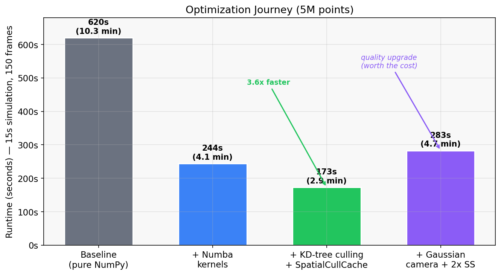
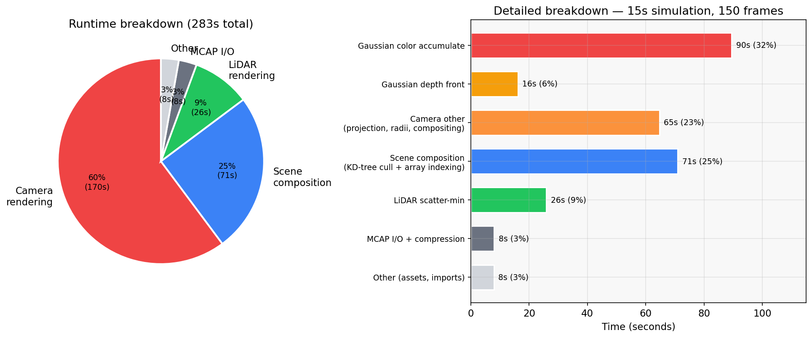
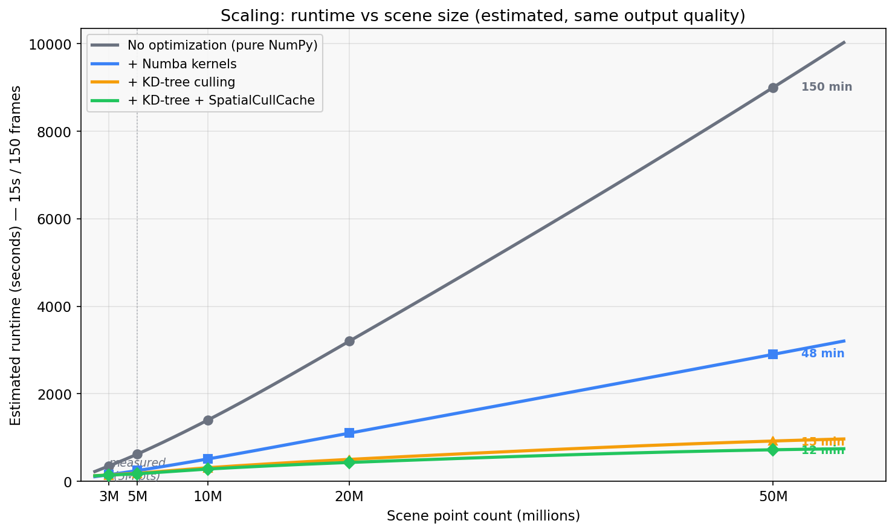

# SensorDataSim

Offline sensor simulation on Toronto-3D point cloud data (`L002`), exported as an MCAP file for Foxglove. The output contains a VLP-16 style LiDAR stream, a pinhole RGB camera stream, and a TF tree, with two dynamic cars added to the static scene.

Final demo video (LiDAR + camera side-by-side):

<a href="https://www.youtube.com/watch?v=cVbzTud8lWQ">
  
</a>

## What this project does

This project takes a real MLS point cloud (Toronto-3D) and turns it into a replayable sensor simulation. I used tile `L002` because it has a long straight road, enough parked cars, and a good mix of background structure (buildings, trees, poles, wires).

The final output is a 15-second MCAP that can be opened directly in Foxglove. It includes TF, LiDAR, and camera data. The camera stream in the final config is compressed (`/camera/image_raw/compressed`).

**Pipeline overview:**

```
Toronto-3D L002 (raw MLS point cloud)
  → Preprocess (voxel downsample, semantic labels, car extraction)
  → Scene composition (static scene + full-res cars + dynamic agents)
  → Timeline (integer-tick event scheduler)
  → LiDAR renderer (VLP-16 scatter-min) + Camera renderer (Gaussian splat)
  → MCAP writer → Foxglove-ready output
```

## Quick run

**Environment setup** (Python 3.11, conda):

```powershell
conda create -n sensorsim python=3.11 numpy scipy numba open3d opencv-python-headless plyfile pyyaml -c conda-forge
conda activate sensorsim
pip install -e .
```

**Data**: download the preprocessed data folder from [Google Drive](https://drive.google.com/file/d/13fMaM-V49mz2RXGd4yEihV_EWt5AnqYq/view?usp=sharing) and extract it to `data/processed/`. This contains the voxel-downsampled static scene, semantic labels, intensity arrays, a full-resolution static-car subset, dynamic car assets, and preprocessing metadata. If you want to run preprocessing from scratch, put the Toronto-3D files under `data/raw/Toronto_3D/` (at minimum `L002.ply`, `Mavericks_classes_9.txt`, `Colors.xml` from [Toronto-3D](https://github.com/WeikaiTan/Toronto-3D)) and run `conda run -n sensorsim python scripts/preprocess.py`.

**Run the simulation**:

```powershell
conda run -n sensorsim python run_sim.py
```

The output MCAP is written to `data/processed/` by default. Use `--output path/to/file.mcap` to override.

**Open in Foxglove**:

```powershell
foxglove-studio data/processed/sim_output.mcap
```

Foxglove notes: use `/camera/image_raw/compressed` for the image panel. For LiDAR, use `/velodyne_points` and set `Color By = intensity`.

**Development / tests:**

```powershell
pip install -e ".[dev]"
pytest
```

## Configuration (sim.yaml)

Everything is configured in `sim.yaml`. The final run uses a 15 second timeline with `10 Hz` LiDAR, `10 Hz` camera, and `50 Hz` TF. The camera is a pinhole model at `1280x720` with `fx=fy=600`, and the final camera renderer runs with Gaussian depth-aware splatting plus `2x` supersampling. Camera output is written as compressed PNG images in a ROS `CompressedImage` topic.

Waypoints in the YAML are stored as `[Y, X]` (not `[X, Y]`). Sensor mounts are attached to `base_link` (`velodyne` at `z=1.8`, camera at `x=0.5, z=1.5`).

## Preprocessing (Toronto-3D L002)

The preprocessing script (`scripts/preprocess.py`) builds a runtime-friendly static scene from the raw Toronto-3D point cloud. It runs a 13-step pipeline:

1. Integrity checks and SHA256 verification
2. Class map parsing
3. Field loading and NaN/Inf audit
4. Road-centered ROI cropping
5. Coordinate normalization to a local origin
6. RANSAC ground plane fitting
7. Car extraction (DBSCAN clustering + PCA orientation + geometric plausibility checks)
8. Static scene construction by provenance (removing the extracted cars)
9. Statistical outlier removal
10. Voxel downsampling with per-voxel label/intensity aggregation
11. Scene coverage verification
12. Output serialization with reload checks
13. Final QC report

One important design choice is that I do not treat cars the same way as the rest of the scene. MLS cars are already sparse and often incomplete. If I downsample them aggressively, they look much worse in the camera view. So I keep a downsampled global static scene for performance and a separate full-resolution static-car subset for the camera renderer.

The current processed static scene is about `5M` points after downsampling (`0.05 m` voxel size), down from about `10M` points after ROI filtering.

## Dynamic cars

I built a small car asset pipeline (`scripts/build_car_asset_library.py`) using semantic car labels + DBSCAN clustering + simple geometry checks. The final dynamic asset is based on a car cluster from `L003`. It had one side more complete than the other, so I mirrored/fixed it to make a better symmetric dynamic model.

The final scene uses two dynamic cars:
- one oncoming car
- one same-direction car that passes the ego vehicle

## Trajectories (ego and agents)

Trajectories are spline-based (`sim/trajectory.py`). Waypoints are fit with cubic splines, parameterized by arc length, and then evaluated at constant speed (`s(t) = v * t`). Yaw is computed from the spline tangent.

A single global ground plane was not enough for vehicle Z placement. It made cars look sunk into the road in some segments and made the ego camera look too low. To fix this, I added a local road-height model (`sim/road_surface.py`) using a KD-tree over road-labeled points (`Ground` + `Road_markings`), with robust estimation (median + MAD clipping + Gaussian distance weighting). This approach works on any road geometry, not just flat roads. The L002 scene has a slight slope, and the model handles it correctly by querying local elevation at each position rather than assuming a single plane.

I also smooth the road-height profile along the trajectory and estimate pitch from local road grade. This keeps vehicles visually attached to the road while avoiding camera shake from raw point noise.

## Simulation design

The simulator is event-driven (`run_sim.py` + `sim/timeline.py`) using integer nanosecond ticks to avoid timing drift between TF, LiDAR, and camera. At each timestamp, the code composes the scene once (static background + full-res static cars + dynamic agents) and reuses it for whichever sensors fire on that tick.

For LiDAR, I use a VLP-16 style "scatter-min" renderer (`sim/lidar.py` + `sim/numba_kernels.py`). Instead of ray casting or mesh-based ray tracing, each point is transformed into LiDAR frame, assigned to a ring/azimuth cell, and the nearest point per cell wins. Ray casting would require meshing the point cloud first, which introduces artifacts on sparse MLS data and adds significant complexity. The scatter-min approach operates directly on point cloud input, naturally produces the (ring, azimuth) structure of a real spinning LiDAR, and is straightforward to accelerate with Numba. Dynamic car points are painted with a bright intensity value so they appear red in Foxglove's default intensity colormap, making them immediately distinguishable from the static scene.

For the camera, I use a pinhole point-splat renderer (`sim/camera.py`) rather than ray casting or voxelization. Ray casting has the same meshing problem as LiDAR. Voxelization would quantize colors and lose detail at the resolution of MLS data. Point splatting works directly on colored points: project, splat with a small radius, blend. No intermediate representation needed. It also naturally extends to depth-aware Gaussian weighting and adaptive radii (see below).

## Camera image improvements

The final camera renderer is not the original hard-circle splat renderer. It now uses a two-pass depth-aware Gaussian splat pipeline:

- Pass A builds a front depth buffer (nearest depth per pixel)
- Pass B accumulates Gaussian-weighted color only near that front surface

This reduces harsh splat edges and background bleed-through. On top of the Gaussian pipeline, several other improvements contribute to the final image quality:

- **Adaptive splat radii**: each point's radius scales with depth (larger up close, smaller at distance), so near objects don't show gaps and far objects don't smear
- **Density-based radius boost**: in sparse regions (measured per coarse tile), the splat radius is increased to fill holes without affecting dense areas
- **Hybrid full-res static cars**: the static-car subset is rendered at original point cloud resolution (not voxel-downsampled) so parked cars retain detail in the camera view
- **`2x` supersampling**: the renderer works at double internal resolution then downsamples with `INTER_AREA`, which smooths splat boundaries and reduces aliasing

Before/after camera comparison video (old renderer vs Gaussian + supersampling):

<a href="https://www.youtube.com/watch?v=CS0ytRj9hzo">
  
</a>

## Performance and optimization

I first made the simulation correct, then optimized it enough to iterate comfortably. All profiling was done with `cProfile` on an i7-11800H (8 cores, 16 GB RAM).

**Optimization journey** - each stage reduced runtime at the same output quality (all normalized to 15s / 150 frames):



The baseline pure-NumPy renderer took ~10.3 min for a 15s simulation. Numba JIT kernels for LiDAR scatter-min and camera splatting brought it down to ~4.1 min (2.5x). Adding KD-tree spatial culling with a `SpatialCullCache` in `sim/scene_compose.py` reached ~2.9 min (3.6x total). The cache queries a superset from the KD-tree with a margin, caches the indices, and filters by squared XY distance each frame, only refreshing when ego moves beyond a threshold or the cache ages out. This avoids expensive repeated `query_ball_point` calls on the full static scene. The final Gaussian camera + 2x supersampling upgrade added rendering cost back, trading speed for significantly better image quality at ~4.7 min.

**Runtime breakdown** of the final submission run (283s):



Camera rendering dominates at 60% (170s), with Gaussian color accumulation alone at 90s. Scene composition (KD-tree culling + NumPy array indexing) is the second cost at 25%. LiDAR is relatively cheap at 9% after the Numba scatter-min optimization. MCAP I/O including PNG compression is only 3%.

**Estimated scaling** - how each optimization layer scales with scene size:



At the current scene size (5M points) all optimizations are relatively close. But the curves diverge sharply at larger scenes: at 50M points, pure NumPy would take ~2 hours, Numba alone ~40 min, while KD-tree culling + `SpatialCullCache` keeps it under ~12 min. The key insight is that KD-tree culling changes the effective complexity: instead of processing all N points every frame, only the local subset within the cull radius is touched. The cache amplifies this by avoiding repeated tree queries on consecutive frames where ego hasn't moved far. These estimates are extrapolated from the measured 5M data point using the algorithmic complexity of each layer (O(N log N) for baseline sorting, O(N) for Numba, sublinear for culled local subsets).

I did not implement multithreading or a GPU renderer. For this project, CPU + Numba already reached a usable runtime, and GPU/parallel paths would add a lot of complexity (atomics/conflict handling for splats, data transfer/setup, portability issues for reviewers).

## Output and Foxglove playback

The output MCAP contains:
- `/tf_static`
- `/tf`
- `/velodyne_points`
- `/camera/image_raw/compressed`
- `/camera/camera_info`

LiDAR points are exported as ROS `PointCloud2` with `x, y, z, intensity, ring` (plus padding). I remap intensity for visualization: static/background points are compressed into a darker band, and dynamic car points are assigned a bright constant value (`255`). In Foxglove with `Color By = intensity`, this paints the moving cars in a distinct bright color (red in the default colormap), making them immediately visible against the static scene.

## Code structure

The runtime pipeline is: load assets -> build trajectories -> for each tick: compose scene -> render LiDAR/camera -> write MCAP.

The core runtime lives in `sim/`:
- `camera.py` - two-pass Gaussian splat camera renderer
- `lidar.py` - VLP-16 scatter-min LiDAR renderer
- `scene_compose.py` - per-frame scene composition with spatial culling
- `trajectory.py` - spline-based trajectory with road-height tracking
- `mcap_writer.py` - MCAP serialization (ROS 2 message dicts)
- `tf_tree.py`, `timeline.py` - TF snapshot management and event scheduling
- `numba_kernels.py` - JIT-compiled kernels for LiDAR and camera hot loops
- `assets.py`, `config.py`, `transforms.py`, `road_surface.py` - data loading, config, geometry utilities

`run_sim.py` is the orchestration entry point. The `scripts/` folder contains preprocessing and helper tools (preprocess, car asset extraction, ego fitting, agent planning, video generation).

## Limitations

This is a point-cloud simulation pipeline, not a full physical sensor simulator. I did not model motion blur, rolling shutter, weather, lighting changes, or complex agent behavior. Dynamic agents in the final config are based on a small car asset set (one mirrored car asset reused). These are reasonable next steps if more time is available.

## Repository note

After initial submission, I made a small maintenance-only update (no functional changes): replaced `assert`-based validation with explicit exceptions (`ValueError`/`RuntimeError`, works correctly under `python -O`), added `pyproject.toml` for editable install, and added unit tests for config, timeline, and transforms. The original submission state is tagged as `submission-v1`.
